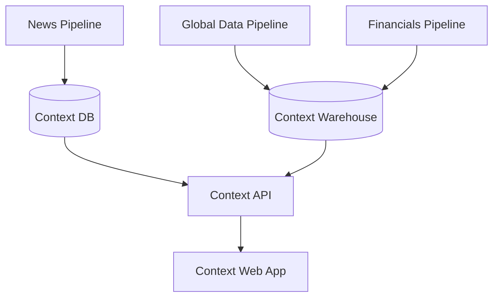

# Context

Context is a news analytics & intelligence platform that turns raw reporting into evolving, data-backed event timelines.

## Components

| Component                | Description                                                                                                                                    |
| ------------------------ | ---------------------------------------------------------------------------------------------------------------------------------------------- |
| **News Pipeline**        | Ingests news from RSS feeds, cleans and enriches articles (NER, embeddings, locations), and incrementally clusters them into evolving stories. |
| **Global Data Pipeline** | Ingests and normalizes historical public datasets (economic, demographic, environmental, geopolitical) into a warehouse-style schema.          |
| **Financials Pipeline**  | Collects and processes financial and market data for use as contextual indicators.                                                             |
| **Context DB**           | Primary transactional store for story state, clustering metadata, and article–story relationships.                                             |
| **Context Warehouse**    | Analytical store for global and historical indicator data used to contextualize stories.                                                       |
| **Context API**          | Assembles stories, articles, and relevant contextual data into query-ready responses for clients.                                              |
| **Context Web App**      | Web interface for exploring stories and their real-world context.                                                                              |

## Architecture

